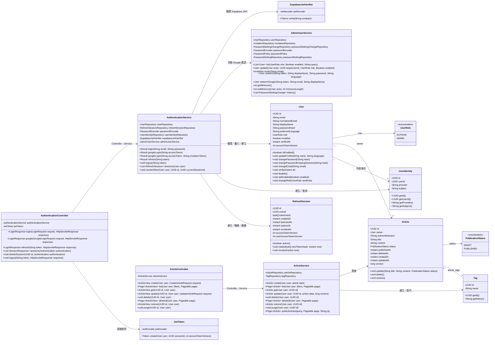

# Class Diagram：應用層核心關係

本圖呈現目前實作的核心領域與應用類別。`AuthenticationController` 直接使用 `JwtToken`；`AuthenticationService` 不依賴 `JwtToken`。

```mermaid
classDiagram
    direction LR

    class User {
        -UUID id
        -String email
        -String normalizedEmail
        -String displayName
        -String passwordHash
        -String preferredLanguage
        -UserRole role
        -boolean enabled
        -Instant verifiedAt
        -int accessTokenVersion
        +boolean isEnabled()
        +void updateProfile(String name, String language)
        +void changePassword(String hash)
        +void changePasswordKeepingSessions(String hash)
        +void changeEmail(String email)
        +void verify(Instant at)
        +void disable()
        +void setEnabled(boolean enabled)
        +void changeRole(UserRole newRole)
    }

    class UserIdentity {
        -UUID id
        -UUID userId
        -String provider
        -String subject
        +UUID getId()
        +UUID getUserId()
        +String getProvider()
        +String getSubject()
    }

    class Article {
        -UUID id
        -User owner
        -String authorAttribution
        -String title
        -String content
        -PublicationStatus status
        -Instant publishedAt
        -Instant deletedAt
        -Instant createdAt
        -Instant updatedAt
        -long version
        +void update(String title, String content, PublicationStatus status)
        +void delete()
        +void restore()
    }

    class Tag {
        -UUID id
        -String name
        +UUID getId()
        +String getName()
    }

    class RefreshSession {
        -UUID id
        -UUID userId
        -byte[] tokenHash
        -Instant createdAt
        -Instant lastUsedAt
        -Instant expiresAt
        -Instant revokedAt
        -int accessTokenVersion
        -int userAccessTokenVersion
        +boolean active()
        +void rotate(byte[] newTokenHash, Instant now)
        +void revoke(Instant now)
    }

    class SupabaseJwtVerifier {
        -JwtDecoder jwtDecoder
        +Claims verify(String compact)
    }

    class AuthenticationController {
        -AuthenticationService authenticationService
        -JwtToken jwtToken
        +LoginResponse login(LoginRequest request, HttpServletResponse response)
        +LoginResponse google(GoogleLoginRequest request, HttpServletResponse response)
        +LoginResponse refresh(String token, HttpServletResponse response)
        +List~SessionResponse~ sessions(Authentication authentication)
        +void deleteSession(UUID id, Authentication authentication)
        +void logout(String token, HttpServletResponse response)
    }

    class AuthenticationService {
        -UserRepository userRepository
        -RefreshSessionRepository refreshSessionRepository
        -PasswordEncoder passwordEncoder
        -UserIdentityRepository userIdentityRepository
        -SupabaseJwtVerifier supabaseJwtVerifier
        -AdminUserService adminUserService
        +Result login(String email, String password)
        +Result googleLogin(String accessToken)
        +Result googleLogin(String accessToken, String invitationToken)
        +Result refresh(String token)
        +void logout(String token)
        +List~RefreshSession~ sessions(User user)
        +void revokeOther(User user, UUID id, UUID currentSessionId)
    }

    class AdminUserService {
        -UserRepository userRepository
        -InvitationRepository invitationRepository
        -PasswordSettingChangeRepository passwordSettingChangeRepository
        -PasswordEncoder passwordEncoder
        -PasswordPolicy passwordPolicy
        -PasswordSettingRepository passwordSettingRepository
        +List~User~ list(UserRole role, Boolean enabled, String query)
        +User update(User actor, UUID targetUserId, UserRole role, Boolean enabled)
        +Invitation invite(String email)
        +User redeem(String token, String displayName, String password, String language)
        +User redeemGoogle(String token, String email, String displayName)
        +int getMinimum()
        +int setMinimum(User actor, int minimumLength)
        +List~PasswordSettingChange~ history()
    }

    class ArticleController {
        -ArticleService articleService
        +ArticleView create(User user, CreateArticleRequest request)
        +Page~ArticleView~ list(User user, filters, Pageable page)
        +ArticleView get(UUID id, User user)
        +ArticleView update(UUID id, User user, UpdateArticleRequest request)
        +void delete(UUID id, User user)
        +Page~ArticleView~ deleted(User user, Pageable page)
        +ArticleView restore(UUID id, User user)
        +void purge(UUID id, User user)
    }

    class ArticleService {
        -ArticleRepository articleRepository
        -TagRepository tagRepository
        +Article create(User user, article data)
        +Page~Article~ list(User user, filters, Pageable page)
        +Article get(User user, UUID id)
        +Article update(User user, UUID id, article data, long version)
        +void delete(User user, UUID id)
        +Page~Article~ deleted(User user, Pageable page)
        +Article restore(User user, UUID id)
        +void purge(User user, UUID id)
        +Page~Article~ publicArticles(query, Pageable page, String ip)
    }

    class JwtToken {
        -JwtEncoder jwtEncoder
        +Token create(User user, UUID sessionId, int accessTokenVersion)
    }

    class UserRole {
        <<enumeration>>
        AUTHOR
        ADMIN
    }

    class PublicationStatus {
        <<enumeration>>
        DRAFT
        PUBLISHED
    }

    AuthenticationController --> AuthenticationService : Controller→Service
    AuthenticationController --> JwtToken : 直接使用
    AuthenticationService --> SupabaseJwtVerifier : 驗證 Supabase JWT
    AuthenticationService --> AdminUserService : 兌換 Google 邀請
    AuthenticationService --> User : 驗證／載入／建立
    AuthenticationService --> UserIdentity : 建立／查詢
    AuthenticationService --> RefreshSession : 建立／輪替／撤銷
    ArticleController --> ArticleService : Controller→Service
    ArticleService --> Article : 管理
    ArticleService --> Tag : 建立／取代
    User --> UserRole : role
    Article --> PublicationStatus : status
    User "1" --> "0..*" Article : owner
    User "1" --> "0..*" UserIdentity : 外部身份
    Article "0..*" -- "0..*" Tag : article_tags
```

