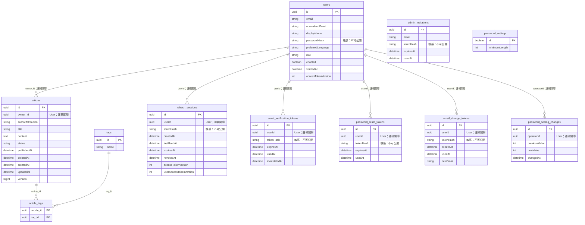

# ERD：核心資料模型

本圖整理目前實作的核心資料表與關係。`owner_id`、`userId` 僅表示應用層的「邏輯關聯」，不描述臆測的資料庫 FK；`passwordHash` 與 `tokenHash` 為敏感欄位，不可公開。

```mermaid
erDiagram
    users {
        uuid id PK
        string email
        string normalizedEmail
        string displayName
        string passwordHash "敏感：不可公開"
        string preferredLanguage
        string role
        boolean enabled
        datetime verifiedAt
        int accessTokenVersion
    }

    articles {
        uuid id PK
        uuid owner_id "User；邏輯關聯"
        string authorAttribution
        string title
        text content
        string status
        datetime publishedAt
        datetime deletedAt
        datetime createdAt
        datetime updatedAt
        bigint version
    }

    tags {
        uuid id PK
        string name
    }

    article_tags {
        uuid article_id PK
        uuid tag_id PK
    }

    refresh_sessions {
        uuid id PK
        uuid userId "User；邏輯關聯"
        string tokenHash "敏感：不可公開"
        datetime createdAt
        datetime lastUsedAt
        datetime expiresAt
        datetime revokedAt
        int accessTokenVersion
        int userAccessTokenVersion
    }

    email_verification_tokens {
        uuid id PK
        uuid userId "User；邏輯關聯"
        string tokenHash "敏感：不可公開"
        datetime expiresAt
        datetime usedAt
        datetime invalidatedAt
    }

    password_reset_tokens {
        uuid id PK
        uuid userId "User；邏輯關聯"
        string tokenHash "敏感：不可公開"
        datetime expiresAt
        datetime usedAt
    }

    email_change_tokens {
        uuid id PK
        uuid userId "User；邏輯關聯"
        string tokenHash "敏感：不可公開"
        datetime expiresAt
        datetime usedAt
        string newEmail
    }

    admin_invitations {
        uuid id PK
        string email
        string tokenHash "敏感：不可公開"
        datetime expiresAt
        datetime usedAt
    }

    password_settings {
        boolean id PK
        int minimumLength
    }

    password_setting_changes {
        uuid id PK
        uuid operatorId "User；邏輯關聯"
        int previousValue
        int newValue
        datetime changedAt
    }

    users ||--o{ articles : "owner_id；邏輯關聯"
    articles ||--o{ article_tags : article_id
    tags ||--o{ article_tags : tag_id
    users ||--o{ refresh_sessions : "userId；邏輯關聯"
    users ||--o{ email_verification_tokens : "userId；邏輯關聯"
    users ||--o{ password_reset_tokens : "userId；邏輯關聯"
    users ||--o{ email_change_tokens : "userId；邏輯關聯"
    users ||--o{ password_setting_changes : "operatorId；邏輯關聯"
```
