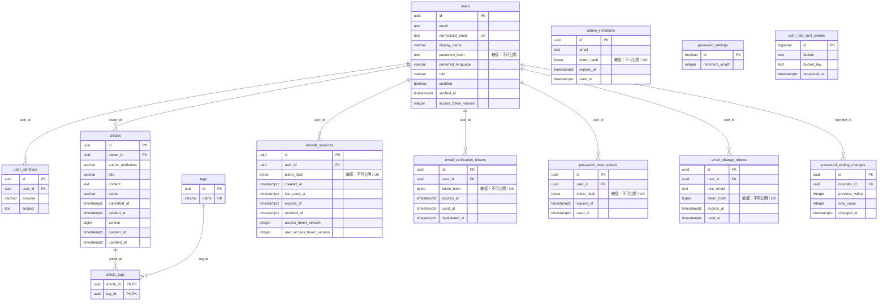

# ERD：核心資料模型

本圖整理目前實作的核心資料表與關聯（以 Liquibase migrations 為準）。外鍵關聯皆具備實體資料庫 FK 限制；`password_hash` 與 `token_hash` 為敏感欄位，不可公開。

```mermaid
erDiagram
    users {
        uuid id PK
        text email
        text normalized_email UK
        varchar display_name
        text password_hash "敏感：不可公開"
        varchar preferred_language
        varchar role
        boolean enabled
        timestamptz verified_at
        integer access_token_version
    }

    user_identities {
        uuid id PK
        uuid user_id FK
        varchar provider
        text subject
    }

    articles {
        uuid id PK
        uuid owner_id FK
        varchar author_attribution
        varchar title
        text content
        varchar status
        timestamptz published_at
        timestamptz deleted_at
        bigint version
        timestamptz created_at
        timestamptz updated_at
    }

    tags {
        uuid id PK
        varchar name UK
    }

    article_tags {
        uuid article_id PK,FK
        uuid tag_id PK,FK
    }

    refresh_sessions {
        uuid id PK
        uuid user_id FK
        bytea token_hash "敏感：不可公開 / UK"
        timestamptz created_at
        timestamptz last_used_at
        timestamptz expires_at
        timestamptz revoked_at
        integer access_token_version
        integer user_access_token_version
    }

    email_verification_tokens {
        uuid id PK
        uuid user_id FK
        bytea token_hash "敏感：不可公開 / UK"
        timestamptz expires_at
        timestamptz used_at
        timestamptz invalidated_at
    }

    password_reset_tokens {
        uuid id PK
        uuid user_id FK
        bytea token_hash "敏感：不可公開 / UK"
        timestamptz expires_at
        timestamptz used_at
    }

    email_change_tokens {
        uuid id PK
        uuid user_id FK
        text new_email
        bytea token_hash "敏感：不可公開 / UK"
        timestamptz expires_at
        timestamptz used_at
    }

    admin_invitations {
        uuid id PK
        text email
        bytea token_hash "敏感：不可公開 / UK"
        timestamptz expires_at
        timestamptz used_at
    }

    password_settings {
        boolean id PK
        integer minimum_length
    }

    password_setting_changes {
        uuid id PK
        uuid operator_id FK
        integer previous_value
        integer new_value
        timestamptz changed_at
    }

    auth_rate_limit_events {
        bigserial id PK
        text bucket
        text bucket_key
        timestamptz requested_at
    }

    users ||--o{ user_identities : "user_id"
    users ||--o{ articles : "owner_id"
    articles ||--o{ article_tags : "article_id"
    tags ||--o{ article_tags : "tag_id"
    users ||--o{ refresh_sessions : "user_id"
    users ||--o{ email_verification_tokens : "user_id"
    users ||--o{ password_reset_tokens : "user_id"
    users ||--o{ email_change_tokens : "user_id"
    users ||--o{ password_setting_changes : "operator_id"
```

