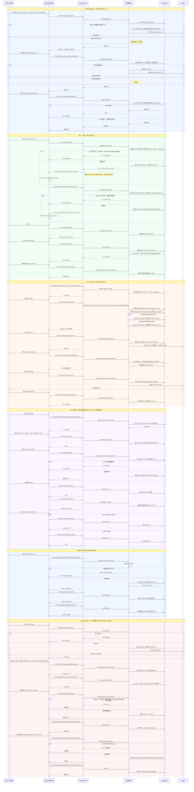

# SSD：系統端到端流程

本圖以功能群組呈現從 Public Registration、認證與帳戶管理，到 Article、Public Article 與 Admin 管理的端到端流程；每個群組仍在同一張 sequence diagram 中依序描述。

```mermaid
sequenceDiagram
    participant V as 訪客／使用者
    participant UI as Angular 管理介面
    participant API as Spring Boot API
    participant S as 領域服務
    participant DB as PostgreSQL
    participant MP as Mailpit

    rect rgb(239, 246, 255)
        Note over V,MP: Public Registration、Email Verification Link
        V->>UI: 填寫 Email、Display Name、Password、Preferred Language
        UI->>API: POST /api/v1/auth/registrations
        API->>S: publicRegistration()
        S->>DB: 以 normalized email 查詢 User
        alt 新 User 或既有未驗證 User
            S->>DB: 建立／更新 User；失效舊連結並儲存新 tokenHash
            S->>MP: 寄送 Email Verification Link
            MP-->>V: 收到驗證郵件
        else 既有 Verified User
            Note right of S: 不修改資料、不寄信
        end
        S-->>API: 中性成功
        API-->>UI: 中性成功（不透露 Email 狀態）

        V->>UI: 要求重送 Email Verification Link
        UI->>API: POST /api/v1/auth/email-verifications/resend
        API->>S: resendEmailVerification()
        S->>DB: 查詢未驗證 User、套用限流、失效舊連結
        alt 可寄送新連結
            S->>DB: 儲存新 tokenHash
            S->>MP: 寄送新 Email Verification Link
            MP-->>V: 收到新驗證郵件
        else 不符合寄送條件
            Note right of S: 不寄信
        end
        S-->>API: 中性成功
        API-->>UI: 中性成功

        V->>UI: 提交 Email Verification Link token
        UI->>API: POST /api/v1/auth/email-verifications
        API->>S: verifyEmail(token)
        S->>DB: 以 tokenHash 原子消費連結並標記 User verifiedAt
        alt token 有效
            DB-->>S: 驗證完成
            S-->>API: 成功
            API-->>UI: Email 已驗證
        else token 過期、已使用或已失效
            DB-->>S: 驗證失敗
            S-->>API: 驗證錯誤
            API-->>UI: 錯誤回應
        end
    end

    rect rgb(240, 253, 244)
        Note over V,DB: 登入、JWT、Refresh Session
        V->>UI: 輸入 Email 與 Password
        UI->>API: POST /api/v1/auth/login
        API->>S: login(email, password)
        S->>DB: 以正規化 Email 查詢 User 並檢查 Verified、enabled、Password
        alt User 不存在、未 Verified、未 enabled 或 Password 錯誤
            S-->>API: 401 Unauthorized
            API-->>UI: 401 Unauthorized
        else 驗證成功
            S->>DB: 建立 Refresh Session（只儲存 tokenHash）
            S-->>API: User、refresh token、sessionId
            API-->>UI: JWT access token；Set-Cookie refresh_token
            Note right of API: HttpOnly；Secure；SameSite=Lax；Path=/api/v1/auth
            UI->>UI: 將 access token 保存至 localStorage
        end

        UI->>API: POST /api/v1/auth/refresh（HttpOnly cookie）
        API->>S: refresh(refresh_token)
        S->>DB: 查詢 active Refresh Session 並檢查 User accessTokenVersion
        alt refresh token 無效、過期或已撤銷
            S-->>API: 401 Unauthorized
            API-->>UI: 401 Unauthorized
        else 可更新
            S->>DB: 輪替 tokenHash、更新 lastUsedAt 與 session 版本
            API-->>UI: 新 JWT access token；新的 refresh_token cookie
            UI->>UI: 更新 localStorage access token
        end

        V->>UI: 登出
        UI->>API: POST /api/v1/auth/logout
        API->>S: logout(refresh_token)
        S->>DB: 撤銷目前 Refresh Session
        API-->>UI: 清除 refresh_token cookie

        V->>UI: 查看 Refresh Session
        UI->>API: GET /api/v1/auth/sessions
        API->>S: sessions(User)
        S->>DB: 讀取自己的 active Refresh Session
        DB-->>S: session 清單（目前工作階段、建立與最後使用時間）
        S-->>API: session 清單
        API-->>UI: session 清單
        V->>UI: 撤銷其他 Refresh Session
        UI->>API: DELETE /api/v1/auth/sessions/{id}
        API->>S: revokeOther(User, id, currentSessionId)
        S->>DB: 驗證所有權後撤銷指定 session
        API-->>UI: 成功或 404
    end

    rect rgb(255, 247, 237)
        Note over V,MP: Account profile、Password 與 Email
        UI->>API: GET /api/v1/account/me；PATCH /api/v1/account/profile
        API->>S: 讀取／更新 User profile
        S->>DB: 讀取或保存 Display Name、Preferred Language
        API-->>UI: User profile

        V->>UI: 變更 Password
        UI->>API: PUT /api/v1/account/password
        API->>S: password(User, currentPassword, newPassword, currentSession, logoutCurrentSession)
        S->>DB: 驗證目前 Password 與 Password Minimum Length
        S->>DB: 使用 changePasswordKeepingSessions 更新 passwordHash
        alt logoutCurrentSession=true
            S->>DB: logoutCurrentSession：撤銷所有 Refresh Session
        else logoutCurrentSession=false
            S->>DB: logoutCurrentSession：只撤銷其他 Refresh Session
        end
        API-->>UI: 成功或 409／驗證錯誤

        V->>UI: 忘記 Password
        UI->>API: POST /api/v1/auth/password-resets
        API->>S: requestPasswordReset(email)
        S->>DB: 查詢 User 並儲存 password reset tokenHash
        S->>MP: 寄送 Password 重設郵件（可找到 User 時）
        API-->>UI: 中性成功
        V->>UI: 提交 Password reset link
        UI->>API: POST /api/v1/auth/password-resets/{token}
        API->>S: resetPassword(token, newPassword)
        S->>DB: 原子消費 token、驗證長度並更新 passwordHash
        S->>DB: 撤銷所有 Refresh Session
        API-->>UI: 成功或錯誤回應

        V->>UI: 要求 Email 變更
        UI->>API: POST /api/v1/account/email
        API->>S: requestEmailChange(User, newEmail)
        S->>DB: 儲存 email change tokenHash 與 newEmail
        S->>MP: 寄送 Email change link
        MP-->>V: 收到確認郵件
        V->>UI: 提交 Email change link
        UI->>API: POST /api/v1/auth/email-changes/{token}
        API->>S: confirmEmailChange(token)
        S->>DB: 原子消費 token 並更新 User Email
        API-->>UI: Email 已變更
    end

    rect rgb(250, 245, 255)
        Note over V,DB: Article 管理（Author 僅限自己的 Article；Admin 可管理全部）
        V->>UI: 開啟 Article 列表
        UI->>API: GET /api/v1/articles?title=&status=&tagId=&page=&size=
        API->>S: list(User, title, status, tag, page)
        S->>DB: 依 title／Tag／Publication Status 查詢並分頁
        DB-->>S: Article page
        API-->>UI: Article 列表

        V->>UI: 新增 Article（title、content、Tag、Publication Status）
        UI->>API: POST /api/v1/articles
        API->>S: create(User, article data)
        S->>DB: 建立 Article；建立新 Tag 並建立 article_tags
        API-->>UI: Article

        V->>UI: 編輯 Article（含 version）
        UI->>API: PUT /api/v1/articles/{id}
        API->>S: update(User, id, article data, version)
        S->>DB: 檢查 owner／Admin 權限與 version
        alt version 樂觀鎖衝突
            S-->>API: 409 Conflict
            API-->>UI: 409 Conflict
        else 版本相符
            S->>DB: 更新 Article；建立／取代 Tag 與 article_tags
            API-->>UI: 更新後 Article
        end

        V->>UI: 確認刪除 Article
        UI->>API: DELETE /api/v1/articles/{id}
        API->>S: delete(User, id)
        S->>DB: 設定 deletedAt（軟刪除）
        API-->>UI: 成功
        UI->>API: GET /api/v1/articles/deleted
        API->>S: deleted(User, page)
        S->>DB: 讀取權限範圍內的 Deleted Article
        API-->>UI: Deleted Article 列表

        V->>UI: 30 天內 restore 或 Admin purge
        alt restore 且仍在 30 天內
            UI->>API: POST /api/v1/articles/{id}/restore
            API->>S: restore(User, id)
            S->>DB: 清除 deletedAt
            API-->>UI: restored Article
        else Admin purge
            UI->>API: DELETE /api/v1/articles/deleted/{id}
            API->>S: purge(Admin, id)
            S->>DB: 永久刪除 Article
            API-->>UI: 成功
        end
    end

    rect rgb(239, 246, 255)
        Note over V,DB: Anonymous Public Article 與公開 Tag
        V->>UI: 瀏覽 Public Article／Tag
        UI->>API: GET /api/v1/public/articles?title=&tagId=&page=&size=
        API->>S: publicArticles(query, source IP)
        S->>S: 檢查來源 IP 限流
        alt 超過每分鐘 60 次
            S-->>API: 429 Too Many Requests
            API-->>UI: 429 Too Many Requests
        else 在限流內
            S->>DB: 只查 Published 且未刪除的 Article
            DB-->>S: Public Article page
            API-->>UI: Public Article 清單
            UI->>API: GET /api/v1/public/articles/{id}
            API->>S: publicArticle(id)
            S->>DB: 讀取 Published 且未刪除的內容
            API-->>UI: Public Article 內容
            UI->>API: GET /api/v1/public/tags?page=&size=
            API->>S: publicTags()
            S->>DB: 只讀取被 Public Article 使用的 Tag
            API-->>UI: Public Tag 清單
        end
    end

    rect rgb(254, 242, 242)
        Note over V,MP: Admin Invitation、User 管理與 Password Minimum Length
        V->>UI: Admin 建立 Invitation
        UI->>API: POST /api/v1/admin/invitations
        API->>S: invite(email)
        alt 非 Admin
            S-->>API: 403 Forbidden
            API-->>UI: 403 Forbidden
        else Admin
            S->>DB: 建立 Invitation（只儲存 tokenHash）
            S->>MP: 寄送 Invitation link
            MP-->>V: 收到 Invitation 郵件
            API-->>UI: accepted
        end
        V->>UI: Redeem Invitation，設定 Display Name、Password、Preferred Language
        UI->>API: POST /api/v1/auth/invitations/{token}/redeem
        API->>S: redeemInvitation(token, user data)
        S->>DB: 原子消費 Invitation、建立已驗證 User
        API-->>UI: Invitation User

        UI->>API: GET /api/v1/admin/users?role=&enabled=&q=
        API->>S: list Users（Admin 授權）
        S->>DB: 依 role／enabled／Email／Display Name 篩選
        API-->>UI: User 清單
        V->>UI: 調整其他 User 的 role／enabled
        UI->>API: PATCH /api/v1/admin/users/{id}
        API->>S: update(Admin, id, role, enabled)
        alt 非 Admin、修改自己或會使最後一位 Verified 且 enabled Admin 失效
            S-->>API: 403／409
            API-->>UI: 拒絕變更
        else 通過保護條件
            S->>DB: 更新 User role／enabled
            API-->>UI: 更新後 User
        end

        UI->>API: GET /api/v1/admin/settings/password-minimum-length
        API->>S: getMinimum()
        S->>DB: 讀取 Password Minimum Length
        API-->>UI: 目前設定
        V->>UI: Admin 變更 Password Minimum Length（8–128）
        UI->>API: PUT /api/v1/admin/settings/password-minimum-length
        API->>S: setMinimum(Admin, value)
        alt 非 Admin 或不在 8–128
            S-->>API: 403／驗證錯誤
            API-->>UI: 拒絕變更
        else 合法變更
            S->>DB: 更新 password_settings 並永久保存 Password Setting Change
            API-->>UI: 新設定
        end
        UI->>API: GET /api/v1/admin/settings/password-minimum-length/history
        API->>S: history()
        S->>DB: 讀取 Password Setting Change 歷史
        API-->>UI: 變更歷史
    end
```
